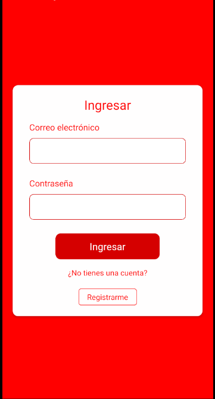
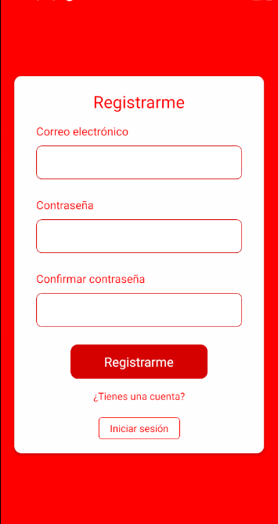
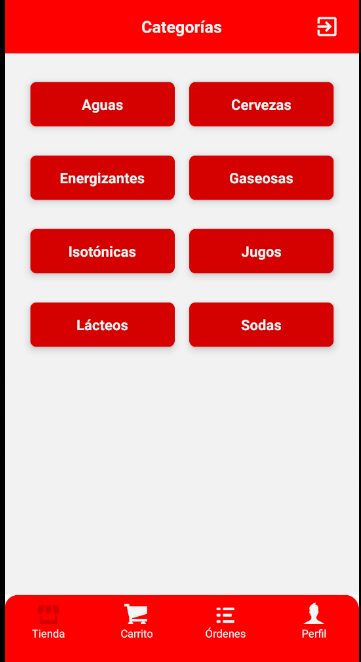
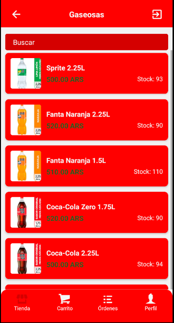
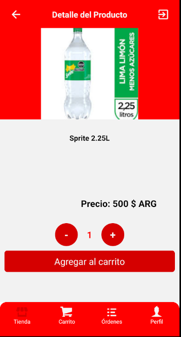
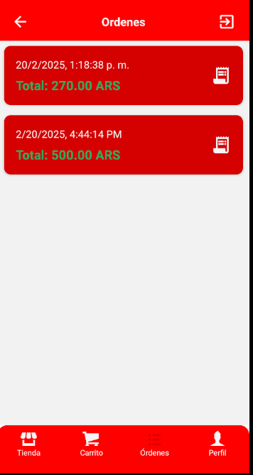
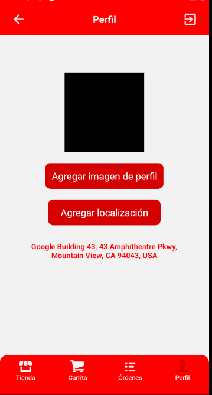
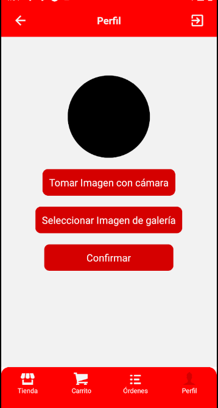
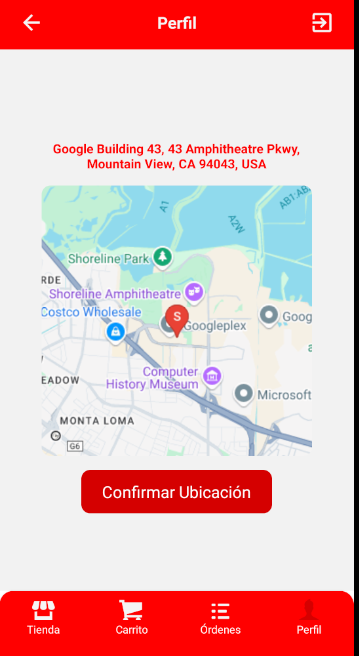

# App Coca-Cola Coder Faccini

Una aplicación de compras electronicas de bebidas linea Coca-Cola, desarrollada por Nicolas Faccini en el marco del curso de Desarrollo de Aplicaciones de Coderhouse. Desarrollada con **React Native** que permite a los usuarios navegar por categorías de productos, ver detalles, agregar productos al carrito y realizar pedidos.

---

## Funcionalidades Principales

### Autenticación con Firebase
- Permite a los usuarios registrarse e iniciar sesión de manera segura.
- Solo los usuarios autenticados pueden acceder a la pantalla de perfil y realizar compras.

---

### Pantalla de Categorías
- Muestra una lista de categorías disponibles.
- Al seleccionar una categoría, se despliega la lista de productos correspondientes.

---

### Pantalla de Productos
- Lista todos los productos disponibles en tarjetas con imágenes, stock dinamico y precios.
- Incluye un buscador dinamico para filtrar productos por nombre.
- Al hacer clic en un producto, se navega a la pantalla de detalles del producto.

---

### Pantalla de Detalles del Producto
- Muestra la imagen, nombre, descripción y precio del producto.
- Indica la cantidad disponible en stock.
- Permite al usuario seleccionar la cantidad y agregar al carrito.

---

### Carrito de Compras
- Muestra los productos agregados por el usuario.
- Permite eliminar productos o modificar la cantidad seleccionada.
- Botón para confirmar la compra y generar una orden.

---

### Historial de Órdenes
- Permite visualizar órdenes realizadas con detalles de cada compra. Por ahora no se puede entrar a cada orden.

---

### Pantalla de Perfil
- Muestra información del usuario.
- Permite cargar una imagen de perfil.
- Opción para gestionar la ubicación del usuario utilizando **Expo-Location**.

---

## Navegación

La app usa `React Navigation` y organiza las pantallas en un **TabNavigator** con cuatro pestañas principales:

**Tienda** -> Explorar categorias y productos
**Carrito** -> Revisar y modificar la compra
**Órdenes** -> Historial de compras realizadas 
**Perfil**  -> Datos del usuario y configuración 

---

## Tecnologías Utilizadas

- **React Native**: Desarrollo multiplataforma.
- **Expo**: Framework para facilitar el desarrollo.
- **Redux Toolkit**: Gestión de estado global.
- **RTK Query**: Manejo de peticiones HTTP con Firebase.
- **Firebase Authentication**: Sistema de autenticación de usuarios.
- **Firebase Realtime Database**: Base de datos en tiempo real.
- **React Navigation**: Manejo de navegación entre pantallas.
- **Expo-Location**: Permite obtener la ubicación del usuario junto a la Api de Google.

---

## Instalación y Ejecución

1. Clona el repositorio:
   git clone https://github.com/nicolasfaccini/proyecto-app-dev-coder/edit/main/app-coca-cola-coder-faccini

2. Instala las dependencias:

   npm install

3. Configura las credenciales de Firebase en `src/database.js`.

4. Ejecuta la aplicación:

   npm start

## 📧 Contacto

Si tienes preguntas o sugerencias, contáctame por mail: nico.faccini1@gmail.com.

